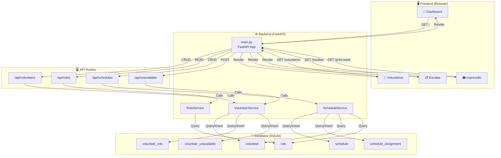

## Architecture Overview

### Layers

1. **Presentation Layer** (Frontend)
   - HTML templates with Jinja2
   - Bootstrap 5 styling
   - JavaScript for interactivity

2. **API Layer** (Routes)
   - RESTful endpoints
   - FastAPI automatic docs at /docs

3. **Business Logic** (Services)
   - VolunteerService
   - RoleService
   - ScheduleService
   - UnavailableService

4. **Data Access Layer** (Database)
   - SQLite connection management
   - CRUD operations
   - Relationship management

### Data Flow Example: Creating a Schedule

```
User clicks "New Schedule"
        ↓
Fill form and submit
        ↓
POST /api/schedules with assignments
        ↓
FastAPI validates and routes to handler
        ↓
ScheduleService.create_schedule() called
        ↓
Insert into schedule table → get schedule_id
        ↓
For each volunteer in assignments:
  - Insert into schedule_assignment table
        ↓
Commit transaction
        ↓
Return created schedule with ID
        ↓
JavaScript updates UI table
        ↓
Success message shown to user
```

### Request/Response Flow

```
Browser HTTP Request
        ↓
FastAPI Router
        ↓
Service Method
        ↓
Database Query
        ↓
Result → JSON
        ↓
FastAPI Response
        ↓
Browser renders/updates
```

### Database Relationships

```
Volunteer (1) ----→ (N) Volunteer_Role ----→ (1) Role
    ↓
    └→ Volunteer_Unavailable
    
Schedule (1) ----→ (N) Schedule_Assignment ----→ (1) Volunteer
                          ↓
                          └→ Role
```

### Technologies Stack

```
┌─────────────────────────────────────┐
│        Client (Browser)             │
│  HTML5 | CSS3 | JavaScript          │
│  Bootstrap 5 Framework              │
└─────────────────────────────────────┘
              ↓ HTTP
┌─────────────────────────────────────┐
│      FastAPI Web Framework          │
│  - Automatic API documentation      │
│  - Type validation (Pydantic)       │
│  - CORS support                     │
└─────────────────────────────────────┘
              ↓
┌─────────────────────────────────────┐
│       Uvicorn ASGI Server           │
│  Async request handling             │
└─────────────────────────────────────┘
              ↓
┌─────────────────────────────────────┐
│        SQLite Database              │
│  - Local file based                 │
│  - ACID transactions                │
│  - Perfect for small deployments    │
└─────────────────────────────────────┘
```

### Deployment Options

```
┌────────────┐
│ Laptop/PC  │ → Direct run with Python
└────────────┘

┌────────────┐
│ Raspberry  │ → Python + Gunicorn + systemd
│ Pi         │
└────────────┘

┌────────────┐
│ Docker     │ → Container deployment
│ Container  │
└────────────┘

┌────────────┐
│ VPS/Cloud  │ → Gunicorn + Nginx reverse proxy
│            │
└────────────┘
```
